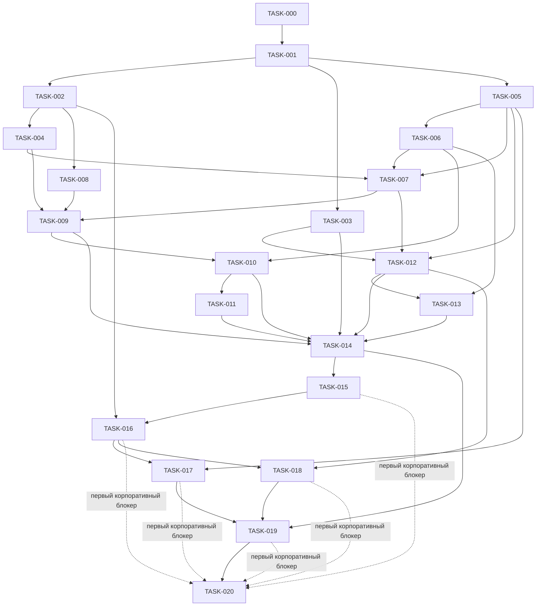

# Бэклог проекта

## Инварианты рабочего процесса

* Допустимые статусы: `TODO`, `ACTIVE`, `DONE` и `BLOCKED`.

* В любой момент времени не более одной задачи может иметь статус `ACTIVE`.

* Задача получает статус `ACTIVE` только после явной инструкции пользователя и только тогда, когда выполнены её обязательные зависимости. Обычная зависимость считается выполненной только тогда, когда она имеет статус `DONE`.

* Завершение или блокировка задачи никогда не активирует её следующую задачу автоматически.

* Когда задача со статусом `ACTIVE` завершена, измените статус только этой задачи на `DONE`, обновите `PROJECT_STATE.md`, порекомендуйте следующую задачу и остановитесь.

* Задача не может быть помечена как `DONE`, если существенная приёмочная проверка недоступна или не пройдена. Зафиксируйте `NOT VERIFIED` и оставьте её в статусе `ACTIVE` либо примените приведённую ниже политику блокировки.

## Политика блокировки

* Изменяйте `ACTIVE` на `BLOCKED` только тогда, когда критерий приёмки невозможно выполнить без отсутствующих пользовательских данных, авторизации, внешнего доступа/состояния или технической предпосылки, которую нельзя безопасно устранить в рамках области задачи.

* Перед блокировкой исчерпайте разумные возможности исследования только для чтения, безопасные альтернативы в рамках области задачи и диагностические проверки. Не расширяйте область задачи и не выдумывайте внешнюю инфраструктуру.

* Зафиксируйте доказательства, точное условие разблокировки, затронутые критерии приёмки и рекомендуемое действие пользователя в `PROJECT_STATE.md` и, при необходимости, в `Notes` задачи.

* `BLOCKED` является конечным состоянием для текущей попытки, оставляет ноль задач со статусом `ACTIVE` и не удовлетворяет обычную нижестоящую зависимость.

* Возобновление заблокированной задачи требует явной инструкции пользователя после изменения условия; переведите эту задачу из `BLOCKED` в `ACTIVE` и не активируйте никакую другую задачу.

* У TASK-020 есть одно исключение только для отчётности: после того как TASK-014 получает статус `DONE`, задокументированный блокер в первой корпоративной задаче, которая не может продолжаться, может открыть путь к отчёту, тогда как нетронутые нижестоящие корпоративные задачи остаются `TODO` и указываются как `NOT VERIFIED`.

## Определение готовности для каждой задачи

В дополнение к критериям приёмки, специфичным для задачи, каждая задача должна:

* сохранять изменения в пределах явно активированной области;

* включать тесты для нового значимого поведения и запускать все релевантные существующие тесты;

* запускать существующие проверки линтинга и типов, если они есть;

* проверять diff в области задачи на наличие секретов, несвязанных изменений и утечек, специфичных для среды выполнения;

* обновлять затронутую долговечную документацию и ADR только тогда, когда это обосновано;

* обновлять этот файл и каждый обязательный раздел `PROJECT_STATE.md` фактическими доказательствами валидации;

* отличать проверенное поведение от утверждений `NOT VERIFIED`.

## Обзор зависимостей

Граф намеренно ацикличен. Зависимости перечисляют прямые предварительные условия; транзитивные предварительные условия подразумеваются. Сплошные стрелки, входящие в TASK-020, показывают её обычный путь; пунктирные стрелки показывают исключение только для отчётности по блокеру, определённое выше.

---

## TASK-000

Название: Архитектура и соглашения репозитория

Статус: DONE

Цель: Установить устойчивую архитектуру, область, рабочий процесс, рекомендации по выбору модели и проверенный бэклог, чтобы другая сессия Codex могла продолжить работу без опоры на историю чата.

Зависимости: Нет

Критерии приёмки:

* Существующее рабочее пространство, границы Git, файлы и принадлежащие пользователю изменения проверены и точно зафиксированы.

* `AGENTS.md` содержит назначение проекта, правила архитектуры и изменений, соглашения, структуру, команды, ограничения безопасности/области, требования к абстракции среды выполнения, правило одной задачи и обязательное правило чтения `PROJECT_STATE.md`.

* `MODEL_GUIDE.md` фиксирует в точности запрошенную консультативную стратегию моделей и указывает, что только пользователь изменяет модель/режим рассуждения.

* `docs/architecture.md` охватывает Client, Agent Orchestrator, Agent, AgentRuntime, DockerRuntime, будущий KataRuntime, Qwen Code, Ollama, Skills, Tools, Workspace, Session, жизненный цикл и основные потоки управления/данных.

* Архитектура представляет декомпозицию задачи как конфигурацию агента, оставляет Ollama внешним/настраиваемым и определяет одну среду выполнения/рабочее пространство/логическую сессию на Agent.

* Нейтральные к среде выполнения границы и ожидания соответствия делают возможной замену Docker на Kata без изменений бизнес-логики Orchestrator.

* Добавлены только архитектурно значимые ADR, решения по которым можно принять сейчас; отложенные факты интеграции явно назначены более поздним задачам.

* `TASKS.md` содержит TASK-000–TASK-020 с допустимыми статусами, целями, прямыми зависимостями, проверяемыми критериями приёмки и запрошенными рекомендациями модели/режима рассуждения.

* Граф зависимостей ацикличен, ни одна будущая задача не активирована, а бэклог включает путь для отчёта о недоступной корпоративной валидации без выдумывания результатов.

* `PROJECT_STATE.md` фиксирует только проверенную текущую функциональность и доказательства валидации.

* Не создано никакой реализации приложения, DockerRuntime, интеграции Qwen, приложения FastAPI, UI или другой реализации будущих задач.

Рекомендуемая модель: GPT-6 Astra

Рекомендуемый режим рассуждения: XHigh

---

## TASK-001

Название: Каркас проекта

Статус: DONE

Цель: Создать минимальный воспроизводимый каркас реализации/тестирования, сохраняющий задокументированные архитектурные границы и не реализующий более поздние функции.

Зависимости: TASK-000

Критерии приёмки:

* Выбраны и задокументированы язык, поддерживаемая версия, инструменты пакетов/сборки и минимальные прямые зависимости разработки/среды выполнения с кратким обоснованием.

* Каталоги исходного кода и тестов реализуют логическое разделение домен/приложение/порты/адаптеры из `docs/architecture.md` без пустых спекулятивных подсистем.

* Точка входа композиции/конфигурации может быть импортирована или вызвана без запуска API или среды выполнения.

* Существуют безопасные соглашения конфигурации и `.env.example`; настоящий `.env` и сгенерированное/исполняемое состояние остаются проигнорированными.

* Воспроизводимые команды установки, тестов, линтинга, проверки форматирования и проверки типов задокументированы в `AGENTS.md` и `PROJECT_STATE.md`.

* Минимальный тест доказывает, что пакет/каркас загружается, и все задокументированные команды качества проходят в чистой среде.

* Не реализованы контракт AgentRuntime, интеграция Docker, интеграция Qwen, HTTP-приложение, тестовый Task API или UI.

Рекомендуемая модель: GPT-5.6 Terra

Рекомендуемый режим рассуждения: Medium

---

## TASK-002

Название: Абстракция AgentRuntime

Статус: DONE

Цель: Определить и протестировать нейтральный к среде выполнения управляющий порт, который должны реализовать все бэкенды исполнения.

Зависимости: TASK-001

Критерии приёмки:

* Проектная абстракция `AgentRuntime` определяет create, start, status, stop и delete с полезными типизированными значениями запросов/результатов.

* Определены непрозрачный дескриптор среды выполнения, нейтральные наблюдения среды выполнения и нормализованные категории ошибок без объектов SDK Docker/Kata или имён состояний.

* Владение жизненным циклом явно определено: Orchestrator владеет состоянием Agent, тогда как среда выполнения сообщает наблюдения и результаты операций; запущенная среда выполнения не считается готовым агентом без сигнала готовности.

* Ожидания идемпотентности/повторов, поведение при недопустимых операциях, тайм-ауты/отмена, очистка после частичного создания и семантика удаления задокументированы и протестированы.

* Детерминированный тестовый драйвер проверяет порт без инфраструктуры, и установлен переиспользуемый контракт тестов соответствия для будущих драйверов.

* Модули приложения/домена не имеют импортов или ветвлений Docker/Kata.

* Обмен разговором/сессией отделён от порта жизненного цикла; представлена только минимальная нейтральная информация о готовности/подключении, требуемая контрактом.

Рекомендуемая модель: GPT-6 Astra

Рекомендуемый режим рассуждения: XHigh

---

## TASK-003

Название: Тестовый Task REST API

Статус: DONE

Цель: Предоставить детерминированный локальный REST-сервис, моделирующий только операции с задачами, необходимые для тестирования ограниченных инструментов агента.

Зависимости: TASK-001

Критерии приёмки:

* Минимальный ресурс задачи и правила валидации поддерживают получение, создание, создание подзадач и обновление без предположений о корпоративной схеме.

* API предоставляет задокументированные локальные эндпоинты, соответствующие поведению `get_task`, `create_task`, `create_subtask` и `update_task`.

* Связи родитель/подзадача, генерируемые ID, поведение при отсутствии объекта, некорректном вводе и конфликте детерминированы и протестированы.

* Локальное состояние изолировано между тестами и использует тестовые фикстуры; не вводятся внешняя база данных, платформа аутентификации, корпоративный эндпоинт или реальные корпоративные данные.

* Эндпоинт сервиса настраивается для потребителей, и задокументированы безопасные примеры запросов.

* Модульные/API-тесты охватывают каждую операцию и ответ с ошибкой.

* Тестовый сервис не импортирует и не зависит от Orchestrator, Docker, Qwen или Skill декомпозиции задач.

Рекомендуемая модель: GPT-5.6 Terra

Рекомендуемый режим рассуждения: Medium

---

## TASK-004

Название: DockerRuntime

Статус: DONE

Цель: Реализовать порт AgentRuntime для локального Docker, полностью сохраняя механику Docker внутри адаптера.

Зависимости: TASK-002

Критерии приёмки:

* `DockerRuntime` реализует полный контракт TASK-002, используя настраиваемый образ и спецификации, принадлежащие проекту.

* ID контейнеров, объекты/исключения Docker SDK, примитивы томов/сети и необработанные значения статусов не покидают адаптер.

* Рабочее пространство, окружение, ограничения ресурсов, разрешённая сеть, метки, готовность, остановка и очистка отображаются в нейтральные входы/результаты с диагностируемыми ошибками.

* Создание и удаление обрабатывают повторы и частичные сбои в соответствии с определённой семантикой и не оставляют ресурсы незаметно осиротевшими.

* Контейнеру агента не предоставляются сокет Docker или неконтролируемые монтирования хоста/привилегии.

* Все общие тесты соответствия AgentRuntime проходят для драйвера Docker с использованием специально созданного безвредного тестового образа/фикстуры, а не с требованием будущего универсального образа Qwen.

* Реальный локальный интеграционный тест Docker проверяет create/start/status/stop/delete и очистку; если Docker нельзя проверить, задача не помечается как `DONE`, а отсутствующее доказательство указывается явно.

* Код Orchestrator/домена остаётся неизменным, за исключением композиции через порт.

Рекомендуемая модель: GPT-5.6 Terra

Рекомендуемый режим рассуждения: High

---

## TASK-005

Название: Интеграция Qwen Code с Ollama

Статус: DONE

Цель: Исследовать и проверить на исполняемом примере, как выбранная версия Qwen Code использует существующий сервис Ollama, включая неинтерактивные ходы и вызовы инструментов.

Зависимости: TASK-001

Критерии приёмки:

* Актуальная авторитетная документация/исходный код Qwen Code и Ollama, относящиеся к конфигурации провайдера, вызову, использованию инструментов и поведению сессии, зафиксированы с версиями и ссылками.

* Qwen Code явно рассматривается как CLI/агентный фреймворк, а Ollama — как внешний хост настроенной Qwen LLM.

* Исполняемый воспроизводимый проверочный сценарий отправляет как минимум один неинтерактивный промпт через Qwen Code на настраиваемые эндпоинт/модель Ollama и получает корректный ответ.

* Безвредный контролируемый проверочный сценарий проверяет, выдаёт ли и каким образом Qwen Code вызов инструмента и завершает его; точный протокол и ограничения задокументированы.

* Эндпоинт, модель, тайм-ауты, необязательные учётные данные и параметры провайдера берутся из явной конфигурации с безопасными локальными примерами и без секретных значений.

* Сценарии отказа различают неверную конфигурацию, проблемы подключения/аутентификации Ollama, недоступную модель и ошибки процесса/протокола Qwen.

* Наблюдаемое поведение сессии/возобновления задокументировано как доказательство для TASK-006 без преждевременного утверждения о персистентности.

* Проверочный сценарий проверен из контекста выполнения, релевантного будущему контейнеру, а любое всё ещё непроверенное предположение о контейнерной сети помечено `NOT VERIFIED` для TASK-007.

Рекомендуемая модель: GPT-5.6 Sol

Рекомендуемый режим рассуждения: High

---

## TASK-006

Название: Постоянная сессия агента Qwen

Статус: DONE

Цель: Реализовать одну изолированную логическую разговорную сессию на каждый Agent, сохраняющую многотуровый контекст с использованием поведения, проверенного для Qwen Code.

Зависимости: TASK-005

Критерии приёмки:

* Выбранный механизм сессии основан на доказательствах TASK-005 и задокументирован, включая нативные артефакты/ID Qwen, сохранённую историю сообщений или обоснованную комбинацию.

* Два или более хода для одного Agent повторно используют одну и ту же логическую сессию, и объективный последующий тест доказывает, что последующий ход помнит предыдущий контекст.

* Разные агенты доказуемо не могут читать состояние сессии или рабочего пространства друг друга.

* Повторное открытие адаптера сессии с той же идентичностью Agent/сессии и рабочим пространством после перезапуска процесса Qwen сохраняет контекст в воспроизводимом тесте.

* Очистка артефактов сессии явная и протестирована; привязка этой очистки к удалению Agent и проверка остановки/запуска среды выполнения отложены до TASK-009 и TASK-014.

* Ожидания по восстановлению после будущего перезапуска Orchestrator задокументированы, но реализация не заявляется до задач Orchestrator.

* Отсутствующее, повреждённое или несовместимое состояние сессии приводит к диагностируемой ошибке без незаметного запуска несвязанного разговора.

* Qwen-специфичные типы персистентности остаются в адаптере; домен использует общие ссылки Agent/Session.

* Не вводится глобальная изменяемая сессия Qwen.

Рекомендуемая модель: GPT-5.6 Sol

Рекомендуемый режим рассуждения: High

---

## TASK-007

Название: Универсальный Docker-образ агента

Статус: DONE

Цель: Собрать переиспользуемый, независимый от задачи образ агента, содержащий Qwen Code и проверенную интеграцию запуска/сессии, готовый принимать настроенные Skills и Tools.

Зависимости: TASK-004, TASK-005, TASK-006

Критерии приёмки:

* Образ фиксирует проверенные версии Qwen Code/среды выполнения и воспроизводимо собирается из закоммиченных несекретных входных данных.

* Ollama и веса модели не устанавливаются и не запускаются в образе; эндпоинт и модель остаются конфигурацией среды выполнения.

* Образ/лаунчер предоставляет задокументированный нейтральный к среде выполнения контракт готовности и взаимодействия, основанный на проверенном поведении Qwen.

* Поддерживаются одно записываемое рабочее пространство на агента и явные места внедрения Skill/Tool без жёстко зашитой логики декомпозиции задач.

* Контейнер запускается от непривилегированного пользователя, где это возможно, не имеет сокета Docker и использует только необходимый доступ к файловой системе/сети.

* Проверочный тест запускает образ через DockerRuntime, достигает настроенного Ollama изнутри контейнера, завершает ход, останавливается, перезапускается и сохраняет протестированное состояние сессии.

* Контекст сборки и созданный образ не содержат учётных данных, локального `.env`, весов модели, корпоративных эндпоинтов/данных или несвязанных файлов.

* Контракт рабочей нагрузки задокументирован в нейтральных к среде выполнения терминах, пригодных для последующего отображения на Kata.

Рекомендуемая модель: GPT-5.6 Terra

Рекомендуемый режим рассуждения: Medium

---

## TASK-008

Название: Основа API Agent Orchestrator

Статус: DONE

Цель: Создать границу HTTP-приложения, корень композиции, конфигурацию и обработку ошибок без реализации будущих эндпоинтов жизненного цикла/чата.

Зависимости: TASK-002

Критерии приёмки:

* Фабрика приложения/корень композиции связывает нейтральные к среде выполнения порты и допускает детерминированные тестовые двойники.

* Транспортные модели запроса/ответа отделены от типов SDK домена, приложения и инфраструктуры.

* При запуске проверяется обязательная конфигурация и выбирается драйвер среды выполнения в коде композиции, а не через ветвление в сценариях использования.

* Минимальная поверхность проверки состояния/запуска и общая редактированная оболочка ошибок задокументированы и протестированы; ни один эндпоинт жизненного цикла агента, сообщений, событий или специфичный для задач эндпоинт не реализован раньше времени.

* Время жизни зависимостей и изменяемое состояние явные; тесты не зависят от скрытого глобального состояния процесса.

* Генерация документации API и тестовый HTTP-клиент работают через воспроизводимые команды.

* Существующие тесты, проверки линтинга и типов проходят без необходимости Docker, Ollama или корпоративного сервиса для базовых тестов.

Рекомендуемая модель: GPT-5.6 Terra

Рекомендуемый режим рассуждения: High

---

## TASK-009

Название: API жизненного цикла агента

Статус: DONE

Цель: Предоставить через HTTP поведение create, inspect, start/readiness, stop и delete посредством Orchestrator и порта AgentRuntime.

Зависимости: TASK-004, TASK-007, TASK-008

Критерии приёмки:

* `POST /agents`, `GET /agents/{agent_id}`, `DELETE /agents/{agent_id}` и выбранные явные HTTP-операции для запуска и остановки существующего Agent имеют задокументированные схемы, коды статусов и редактированные ответы об ошибках; TASK-009 определяет точную форму URI start/stop.

* Отображение между create, start, stop и delete явное; если `POST /agents` объединяет create и start, промежуточные/ошибочные состояния остаются наблюдаемыми и восстанавливаемыми, тогда как stop остаётся независимо вызываемым, чтобы можно было тестировать сохранение сессии stop/start без удаления.

* Orchestrator обеспечивает допустимые переходы `CREATING`, `STARTING`, `READY`, `STOPPING`, `STOPPED` и `FAILED` и отличает запущенную среду выполнения от готового агента.

* Каждый Agent получает уникальный экземпляр среды выполнения, идентичность рабочего пространства/сессии и снимок конфигурации/возможностей, относящийся к этому агенту.

* Дублирование, конкурентность, недопустимое состояние, not-found, readiness-timeout и случаи частичной очистки имеют детерминированное поведение и тесты.

* Delete вызывает настроенный драйвер среды выполнения и сообщает об ошибке очистки вместо удаления доказательств; stop сохраняет сессию/рабочее пространство в соответствии с TASK-006.

* Прикладные сценарии использования вызывают только принадлежащие проекту порты и не содержат Docker-специфичных ветвлений или значений.

* Модульные/API-тесты используют тестовую среду выполнения, а интеграционный тест Docker проверяет тот же жизненный цикл с универсальным образом агента.

Рекомендуемая модель: GPT-5.6 Sol

Рекомендуемый режим рассуждения: High

---

## TASK-010

Название: API чата с состоянием

Статус: DONE

Цель: Добавить нестриминговые ходы сообщений и получение истории сообщений, сохраняя одну сессию на Agent.

Зависимости: TASK-006, TASK-009

Критерии приёмки:

* `POST /agents/{agent_id}/messages` и `GET /agents/{agent_id}/messages` имеют задокументированные схемы, порядок, ID/временные метки, коды статусов и редактированные ошибки.

* Сообщения принимаются только для подходящего Agent, переводят его `READY -> BUSY -> READY` и используют нейтральную к среде выполнения границу взаимодействия/сессии, а не вызовы Docker/Kata.

* Несколько ходов повторно используют одну и ту же логическую сессию; интеграционный тест доказывает, что последующий ответ использует предыдущий контекст.

* Ходы для одного и того же Agent сериализуются с явно задокументированной политикой постановки в очередь или отклонения, тогда как разные агенты остаются изолированными.

* Связь между видимыми через API сообщениями, нативным состоянием сессии Qwen и восстановлением явная; ошибки не могут незаметно создать новую независимую сессию.

* Восстанавливаемые ошибки инференса/инструментов/валидации имеют определённое поведение сообщения/жизненного цикла и не уничтожают автоматически здоровую среду выполнения; невосстанавливаемые сбои диагностируются.

* Получение истории возвращает только данные запрошенного Agent и обеспечивает настроенные лимиты.

* Модульные/API-тесты используют детерминированные тестовые двойники, а интеграционный тест Docker/Ollama проверяет реальный нестриминговый путь.

Рекомендуемая модель: GPT-5.6 Sol

Рекомендуемый режим рассуждения: High

---

## TASK-011

Название: Стриминг / SSE

Статус: DONE

Цель: Добавить проверенный протокол стриминга от сервера к клиенту для ходов агента на основе фактического поведения вывода Qwen Code.

Зависимости: TASK-010

Критерии приёмки:

* Текущее поведение вывода/событий Qwen и потребности HTTP-клиента проанализированы до выбора протокола; SSE выбран или отклонён с задокументированными доказательствами и ADR, если решение является долговременным.

* Если выбран SSE, `GET /agents/{agent_id}/events` (или задокументированный эквивалент, привязанный к ходу) использует стабильную типизированную оболочку для ID хода, последовательности, событий контента/инструментов, завершения и ошибок.

* Порядок событий, терминальные события, буферизация, поведение при отключении/отмене, поддержание соединения и ограниченная PoC-политика переподключения определены явно.

* Стриминг повторно использует ту же сессию и те же правила жизненного цикла/конкурентности, что и нестриминговый чат, и не дублирует бизнес-логику.

* Клиенты не могут подписываться на другой Agent, а стриминговые/логируемые данные подчиняются тем же правилам редактирования и ограничения размера.

* Детерминированные тесты охватывают порядок событий, завершение, ошибку, отключение и поведение с медленным потребителем без реальной модели.

* Реальный интеграционный тест Qwen/Ollama подтверждает инкрементальную доставку, если она заявлена; в противном случае ограничения буферизации помечаются, и задача не описывается ошибочно как потоковая передача токенов.

* Существующий нестриминговый API остаётся работоспособным.

Рекомендуемая модель: GPT-5.6 Sol

Рекомендуемый режим рассуждения: High

---

## TASK-012

Название: Ограниченный инструмент Task REST

Статус: TODO

Цель: Предоставить выбранным агентам операции с задачами по принципу наименьших привилегий через настраиваемый тестовый/совместимый с корпоративным Task-сервис.

Зависимости: TASK-003, TASK-005, TASK-007

Критерии приёмки:

* Qwen Code может обнаруживать и вызывать только явные типизированные операции `get_task`, `create_task`, `create_subtask` и `update_task` (с корректировкой только в случае, если этого требуют доказательства TASK-003).

* Нет операции, принимающей произвольный URL, произвольный HTTP-метод, произвольные заголовки или непроверенное тело запроса.

* Базовый эндпоинт сервиса и необязательные учётные данные являются конфигурацией развёртывания, не управляемой аргументами модели; секретные значения редактируются.

* Входы и ответы сервиса проверяются по схеме, ограничиваются по размеру и преобразуются в диагностируемые результаты инструмента для случаев «не найдено», некорректного ввода, тайм-аута, ошибок авторизации и сбоев сервиса.

* Конфигурация возможностей Agent может не включать инструмент либо разрешать только явное подмножество операций; сам по себе Skill не может предоставить полномочия.

* Модульные тесты доказывают поведение разрешения/запрета и устойчивость к выходу за пределы URL/пути, подмене метода, внедрению заголовков, чрезмерно большому вводу и утечке секретов.

* Интеграционный тест выполняет каждую разрешённую операцию против тестового Task API через тот же протокол инструмента, который использует Qwen Code.

* Ядро среды выполнения/Orchestrator не содержит поведения декомпозиции задач или предположений о корпоративном API.

Рекомендуемая модель: GPT-5.6 Terra

Рекомендуемый режим рассуждения: High

---

## TASK-013

Название: Skill декомпозиции задач

Статус: TODO

Цель: Упаковать поведение первого сценария использования как выбираемый Skill, который предлагает, обсуждает, пересматривает, подтверждает и затем создаёт задачи через ограниченные Tools.

Зависимости: TASK-006, TASK-012

Критерии приёмки:

* `task-decomposition` является версионируемым агентным ассетом, выбираемым через конфигурацию Agent, без ветвления декомпозиции задач в среде выполнения или общем коде Orchestrator.

* Skill направляет агента: понять задачу, предложить структурированную декомпозицию, обсудить/пересмотреть её с дополнительным контекстом и запросить явное подтверждение перед изменением данных.

* До подтверждения не вызывается ни один изменяющий инструмент Task; после подтверждения доступны только выбранные ограниченные операции, а созданные записи задач/подзадач возвращаются пользователю.

* Отмена, изменение требований, частичный сбой инструмента, риск дублирования/повтора и некорректные ответы Task API имеют явное безопасное поведение.

* Полномочия инструмента обеспечиваются политикой возможностей/кодом инструмента, а не доверием к тексту Skill как к авторизации.

* Статические тесты/тесты на фикстурах проверяют пакет и инструкции; контролируемые тесты взаимодействия охватывают сценарии предложения, пересмотра, отклонения без записи, подтверждения с записью и сбоя.

* Как минимум один реальный сценарий Qwen/Ollama демонстрирует предполагаемый поток, а недетерминированные ограничения фиксируются для TASK-014, а не скрываются.

* Skill и фикстуры не содержат секретов, корпоративных эндпоинтов или реальных корпоративных данных.

Рекомендуемая модель: GPT-5.6 Terra

Рекомендуемый режим рассуждения: High

---

## TASK-014

Название: Локальный сквозной тест Docker

Статус: TODO

Цель: Проверить полную локальную универсальную среду выполнения агентов и сценарий декомпозиции задач через публичные HTTP API, Docker, Qwen Code, внешний Ollama и тестовый сервис Task.

Зависимости: TASK-003, TASK-009, TASK-010, TASK-011, TASK-012, TASK-013

Критерии приёмки:

* Воспроизводимый автоматизированный сценарий запускает необходимые локальные сервисы и использует только публичные API Orchestrator, чтобы создать Agent и дождаться `READY`.

* Изнутри Docker Qwen Code достигает настроенной внешней модели Ollama; Ollama не запускается в контейнере агента.

* Сценарий отправляет задачу, получает декомпозицию, предоставляет дополнительный контекст, получает пересмотренную версию и подтверждает или отклоняет создание.

* До подтверждения никакой мутации Task не происходит; после подтверждения агент создаёт задачи через ограниченный инструмент и возвращает записи, совпадающие с тестовым API.

* Последующие ходы доказывают непрерывность сессии, тогда как второй Agent доказывает изоляцию среды выполнения/рабочего пространства/сессии.

* Остановка/запуск жизненного цикла сохраняет обещанное состояние сессии; stop/delete и очистка после сбоев не оставляют тестовых ресурсов среды выполнения.

* Нестримиинговый чат и, если это заявлено в TASK-011, фактическое стриминговое поведение оба проверяются.

* Логи/артефакты предоставляют диагностируемые доказательства, не содержат секретов; тест имеет ограниченные тайм-ауты и задокументированную процедуру очистки/повтора.

* Сценарий успешно запускается против реальных локальных Docker и Ollama. Если один из них недоступен, задача остаётся не `DONE`, а результат явно помечается `NOT VERIFIED`.

Рекомендуемая модель: GPT-5.6 Sol

Рекомендуемый режим рассуждения: High

---

## TASK-015

Название: Исследование и валидация среды Kata

Статус: TODO

Цель: Определить фактический корпоративный контур управления Kata и проверить, что он может удовлетворить нейтральным требованиям рабочей нагрузки/среды выполнения до начала реализации.

Зависимости: TASK-014

Критерии приёмки:

* Авторизованные факты о среде фиксируются без коммита корпоративных эндпоинтов, учётных данных или чувствительной топологии: версии Kata/среды выполнения, API контура управления, путь образа, хранилище, сеть, ресурсы, готовность, логи и очистка.

* Безвредная рабочая нагрузка создаётся, запускается, наблюдается, останавливается и удаляется через фактический предполагаемый контур управления Kata.

* Записываемая персистентность для каждого агента между остановкой/запуском, доступ только для чтения к агентным ассетам, сетевой доступ к одобренным внешним сервисам, выполнение без привилегий root и ограничения изоляции тестируются там, где это авторизовано.

* Каждое семантическое требование AgentRuntime сопоставлено с поддерживаемым поведением, требуемой адаптацией или конкретным разрывом; Docker-образные предположения отклоняются.

* Операционные предпосылки, разрешения, недоступные доказательства и воспроизводимые команды/процедуры валидации безопасно задокументированы.

* Любая архитектурная несовместимость фиксируется в ADR до того, как последующая реализация изменит общий контракт.

* В этой исследовательской задаче не реализуются KataRuntime, производственная платформа развёртывания или выдуманная корпоративная конфигурация.

* Без авторизованного доступа к предполагаемой среде зафиксируйте `NOT VERIFIED` и не помечайте задачу как `DONE`.

Рекомендуемая модель: GPT-6 Astra

Рекомендуемый режим рассуждения: High

Примечания: Эта задача требует доказательств из реальной среды; локальные догадки не являются заменой.

---

## TASK-016

Название: Реализация KataRuntime

Статус: TODO

Цель: Реализовать существующий контракт AgentRuntime поверх проверенного корпоративного контура управления Kata.

Зависимости: TASK-002, TASK-015

Критерии приёмки:

* `KataRuntime` реализует тот же принадлежащий проекту контракт AgentRuntime без изменения бизнес-логики Orchestrator/домена или схем API.

* ID контура управления, API-клиенты, значения статусов, объекты хранилища/сети и учётные данные остаются внутри адаптера.

* Нейтральные семантики рабочего пространства, окружения, ресурсов, готовности, остановки, удаления, повторов, тайм-аутов и очистки после частичного создания отображаются на механизмы, проверенные в TASK-015.

* Неподдерживаемые семантические требования явно приводят к ошибке, а не незаметно ухудшают изоляцию или персистентность.

* Общий набор тестов соответствия AgentRuntime проходит против Kata в авторизованной среде.

* Интеграционные тесты проверяют create/start/status/readiness/stop/delete, retry/cleanup и изоляцию каждого Agent с универсальной рабочей нагрузкой агента.

* Конфигурация и логи не содержат закоммиченных корпоративных эндпоинтов, учётных данных, секретов или чувствительных данных рабочей нагрузки.

* DockerRuntime продолжает проходить те же тесты соответствия, а выбор среды выполнения остаётся конфигурацией корня композиции.

Рекомендуемая модель: GPT-5.6 Sol

Рекомендуемый режим рассуждения: High

---

## TASK-017

Название: Подключение Kata к Ollama

Статус: TODO

Цель: Проверить и усилить инференс Qwen Code из изолированного в Kata Agent к существующему настроенному корпоративному сервису Ollama.

Зависимости: TASK-005, TASK-016

Критерии приёмки:

* Универсальная рабочая нагрузка агента, работающая через KataRuntime, достигает авторизованного эндпоинта Ollama с использованием внешней конфигурации и внедрения секрета среды выполнения.

* Настроенная модель Qwen доступна, и неинтерактивный ответ завершается через Qwen Code; ни сервер Ollama, ни веса модели не добавляются в рабочую нагрузку Agent.

* DNS/маршрутизация, TLS/аутентификация, потребности proxy/no-proxy, сетевая политика, тайм-аут и доверие сертификатам проверены и задокументированы без раскрытия чувствительных значений.

* Неверные учётные данные, недоступный сервис, сбой TLS, недоступная модель и тайм-аут различимы от сбоев жизненного цикла/готовности Kata.

* Ни эндпоинт, ни порт, ни модель, ни сертификат, ни токен, ни корпоративная топология не захардкожены и не закоммичены.

* Воспроизводимый авторизованный интеграционный тест проходит из того же контекста изоляции/сети, который использует KataRuntime.

* Любое ограничение среды фиксируется как `NOT VERIFIED`/`BLOCKED`, а не заменяется утверждением, проверенным только локально.

Рекомендуемая модель: GPT-5.6 Sol

Рекомендуемый режим рассуждения: High

---

## TASK-018

Название: Подключение Kata к Task REST

Статус: TODO

Цель: Проверить ограниченный инструмент Task из изолированного в Kata Agent к одобренному корпоративному REST-сервису Task или авторизованному эквиваленту.

Зависимости: TASK-012, TASK-016

Критерии приёмки:

* Из рабочей нагрузки Kata каждая одобренная ограниченная Task-операция достигает настроенного авторизованного сервиса через предполагаемый адаптер инструмента.

* Эндпоинт сервиса и учётные данные внедряются безопасно и не могут быть выбраны или переопределены аргументами инструмента, сгенерированными моделью.

* DNS/маршрутизация, TLS/аутентификация, доверие сертификатам, proxy/no-proxy, тайм-ауты, ограничения запросов/ответов и редактирование безопасно проверены.

* Запрещённые операции, попытки выхода за пределы пути/URL, неверный ввод, ошибки авторизации, ошибки сервиса и тайм-ауты дают ограниченные диагностические результаты без утечки секретов.

* Валидация использует одобренные непроизводственные/синтетические записи и документирует очистку; никакие реальные корпоративные данные или эндпоинт не попадают в фикстуры или файлы репозитория.

* Тесты подтверждают, что среда выполнения по-прежнему предоставляет только настроенное подмножество операций и не превращается в произвольный REST-клиент.

* Любое отличие схемы от тестового API изолируется в адаптере сервиса/инструмента и не вводит специфичную для задач логику в ядро среды выполнения/Orchestrator.

Рекомендуемая модель: GPT-5.6 Sol

Рекомендуемый режим рассуждения: High

---

## TASK-019

Название: Сквозная валидация Kata

Статус: TODO

Цель: Проверить тот же публичный сценарий жизненного цикла и декомпозиции задач в корпоративной среде Kata без ответвления бизнес-логики Orchestrator.

Зависимости: TASK-014, TASK-017, TASK-018

Критерии приёмки:

* Тот же E2E-сценарий публичного API и утверждения, которые используются локально, запускаются с выбором среды выполнения, изменённым на конфигурацию Kata.

* Создание/готовность Agent, многотуровый контекст, пересмотр декомпозиции, явное подтверждение, ограниченное создание задач, получение результатов, сохранение при stop/start и delete — всё проходит успешно.

* Второй Agent демонстрирует изоляцию среды выполнения/рабочего пространства/сессии/возможностей под Kata.

* Фактическое стриминговое поведение проверяется, если TASK-011 входит в поддерживаемый API.

* Сценарии ошибок и очистки не оставляют тестовых рабочих нагрузок/рабочих пространств Kata и сохраняют редактированные диагностические доказательства.

* В сценарии использования домена/приложения или публичный API не вносится никаких Docker-специфичных изменений; неизбежные семантические различия документируются относительно ADR/известного ограничения.

* Запуск использует авторизованные синтетические данные и не раскрывает учётные данные, корпоративные эндпоинты или чувствительную топологию в закоммиченных артефактах.

* Для статуса `DONE` требуется реальный запуск в предполагаемой среде Kata; в противном случае точная часть помечается `NOT VERIFIED`.

Рекомендуемая модель: GPT-5.6 Sol

Рекомендуемый режим рассуждения: High

---

## TASK-020

Название: Отчёт о результатах и ограничениях RnD

Статус: TODO

Цель: Подготовить основанный на доказательствах итоговый отчёт о проверенной универсальной среде выполнения агентов, выводах по переносимости, ограничениях, рисках и следующих решениях.

Зависимости: TASK-014 плюс либо завершённый корпоративный путь, либо первая задокументированная задача со статусом `BLOCKED` среди TASK-015, TASK-016, TASK-017, TASK-018 и TASK-019

Критерии приёмки:

* Отчёт разделяет проверенные локальные результаты, проверенные корпоративные/Kata результаты, утверждения `NOT VERIFIED` и заблокированную работу со ссылками на тесты/артефакты/ADR.

* Он суммирует архитектуру, заменяемость среды выполнения, семантику жизненного цикла/сессии, выводы по Qwen Code/Ollama, поведение Skills/Tools, границы безопасности и E2E-доказательства; корпоративные задачи, пропущенные после вышестоящего блокера, остаются явно `NOT VERIFIED`.

* Семантические разрывы между Docker и Kata, фактически измеренные наблюдения производительности/эксплуатации, режимы отказа и ограничения PoC указаны без экстраполяции.

* Первый сценарий декомпозиции задач оценивается, при этом выводы остаются сформулированными вокруг универсальной среды выполнения агентов.

* Обработка безопасности/конфиденциальности и все остаточные риски задокументированы без включения секретов, эндпоинтов или чувствительных корпоративных данных.

* Рекомендации отличают обязательное последующее исследование от идей подготовки к промышленной эксплуатации и не реализуют ни то, ни другое.

* Команды и ссылки на доказательства воспроизводимы или явно имеют ограниченный доступ.

* `PROJECT_STATE.md`, `TASKS.md`, `docs/architecture.md` и ссылки ADR согласуются с итоговым фактическим состоянием.

Рекомендуемая модель: GPT-5.6 Terra

Рекомендуемый режим рассуждения: Medium

Примечания: Только для этой отчётной задачи условие допуска считается выполненным, когда TASK-014 имеет статус `DONE` и либо TASK-019 имеет статус `DONE`, либо самая ранняя корпоративная задача, которая не может продолжаться, имеет статус `BLOCKED` в соответствии с политикой блокировки. Более поздние корпоративные задачи могут оставаться `TODO`; отчёт должен помечать их результаты как `NOT VERIFIED`. Это позволяет избежать выдумывания работы лишь для того, чтобы присвоить каждой корпоративной задаче конечный статус.
