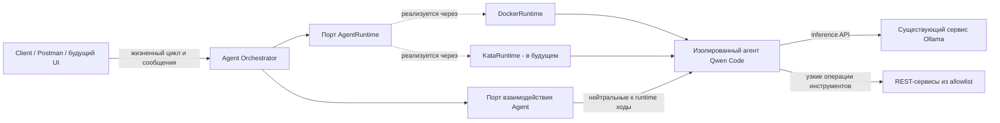
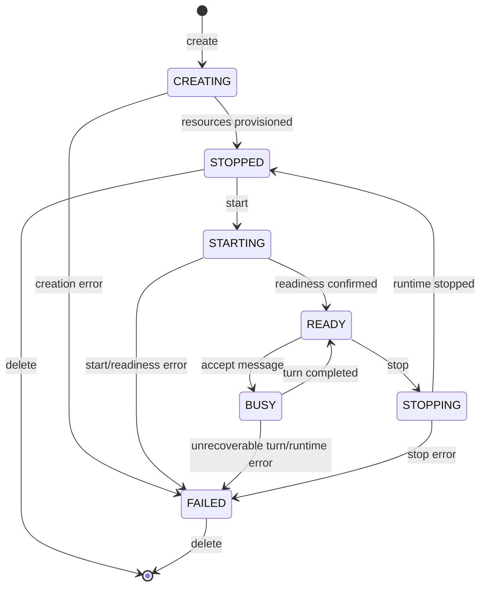

# Архитектура Universal Agent Runtime
Status: TASK-000 establishes the architecture; TASK-001 provides the Python scaffold; TASK-002 defines runtime control; TASK-004 implements DockerRuntime; TASK-006 implements persistent interaction; TASK-007 supplies the universal agent image; TASK-008 establishes HTTP composition; TASK-009 provides lifecycle APIs; TASK-010 implements JSON chat and bounded public history; TASK-011 adds turn-bound SSE with committed response content; TASK-012 adds a restricted Task REST MCP adapter.

## Назначение и область
Система создаёт и управляет изолированными экземплярами CLI-агентов через нейтральный к runtime Agent Orchestrator. Агент сохраняет состояние диалога, получает настроенные Skills и узко ограниченные Tools и использует внешний inference-сервис. Docker является локальным backend исполнения; Kata Containers — более поздний backend для корпоративной среды.
Декомпозиция задач — первая конфигурация агента, используемая для доказательства архитектуры. Она не должна становиться отдельным специализированным сервисом или зависимостью runtime core.
PoC должен доказать:
- создание, просмотр, обмен сообщениями, остановку и удаление агента через REST;
- изоляцию одного runtime, workspace и логической Qwen-сессии на каждого агента;
- многотуровый диалог на протяжении жизненного цикла агента;
- использование Qwen Code существующих настраиваемых endpoint и model Ollama;
- внедрение поведения через Skills и возможностей через ограниченные Tools;
- замену `DockerRuntime` на `KataRuntime` без переписывания бизнес-логики Orchestrator.
Streaming, поддержка Kata и вопросы production-платформы явно отложены до соответствующих задач backlog.

## Архитектурные факторы
- Qwen Code и поведение его сессии являются внешними интеграционными фактами, которые необходимо проверять, а не предполагать.
- Docker и Kata предоставляют разные инфраструктурные API, но должны обеспечивать эквивалентное поведение на уровне приложения.
- Промпты и инструменты Agent пересекают границы доверия и поэтому требуют изоляции и принципа наименьших привилегий.
- PoC требует диагностируемого поведения жизненного цикла без внедрения инфраструктуры production-масштаба.
- Каждая задача реализации может уточнять внутренние типы, но не может менять направление зависимостей, определённое здесь, без ADR.

## Системный контекст

Локальное развёртывание использует `DockerRuntime` и автономный mock Task REST-сервис, реализованный в TASK-003. Его синтетический контракт задокументирован в [mock-task-api.md](mock-task-api.md). Корпоративное развёртывание заменяет `KataRuntime`, существующий корпоративный сервис Ollama и одобренные корпоративные REST-сервисы. Mock-сервис находится вне графа зависимостей Orchestrator/runtime; use cases Orchestrator и правила домена остаются неизменными.

## Плоскости и направление зависимостей
Архитектура разделяет четыре области ответственности:

| Плоскость | Ответственность | Не должна владеть |
|---|---|---|
| Control plane | HTTP-граница, use cases Agent Orchestrator, политика жизненного цикла, метаданные агента | вызовы Docker/Kata SDK, промпты декомпозиции задач |
| Execution plane | runtime-драйвер, изолированный процесс агента, workspace, Qwen Code, runtime readiness | бизнес-решения Orchestrator, размещение модели Ollama |
| Inference plane | существующий Ollama API и настроенная модель Qwen | жизненный цикл Agent или авторизация Tools |
| Service plane | mock- или корпоративные REST-сервисы, доступные через узкие Tools | произвольный сетевой доступ Agent |

Mock-сервис TASK-003 является тестовой зависимостью service plane с process-local состоянием на каждый экземпляр приложения. Он предоставляет только поведение get/create/create-subtask/update. Он не зависит от Orchestrator, runtime, Qwen, Docker, корпоративного сервиса, базы данных или аутентификации. Ограниченный Tool adapter, который впоследствии может его вызывать, остаётся в области TASK-012.
Направление зависимостей на уровне исходного кода:

```text
HTTP adapter --> application use cases --> domain
                        |
                        v
                  application ports
                        ^
                        |
         Docker / Kata / Qwen / storage adapters
```
Composition code выбирает и связывает adapters. Модули domain и application не могут импортировать Docker/Kata SDK, модели HTTP framework или детали реализации Qwen.

## Основные понятия и владение
### Agent
Agent — aggregate жизненного цикла, которым владеет Orchestrator. Концептуально он владеет:
- `agent_id`, генерируемым control plane и стабильным на протяжении его жизненного цикла;
- одной непрозрачной ссылкой на runtime instance;
- одной логической identity Session, Qwen-специфичная ссылка которой принадлежит adapter;
- одной изолированной identity workspace;
- валидированной configuration;
- явными ссылками на capabilities Skill и Tool;
- нейтральным к runtime состоянием жизненного цикла.
Backend IDs, container objects, Kata objects и необработанные credentials не являются полями Agent. Запись Agent может содержать непрозрачные принадлежащие проекту references, отображение которых на backend скрыто внутри adapter.

### AgentRuntime
`AgentRuntime` — обращённый к application управляющий порт для изолированной execution unit. Его минимальная ответственность — create, start, status, stop и delete. Он не владеет семантикой диалога.
Реализованный асинхронный протокол, типизированные требования, observations, errors, правила идемпотентности и семантика ограниченных по времени вызовов определены в [контракте управления runtime](runtime-contract.md). `RuntimeHandle` — непрозрачная, привязанная к Agent project reference. `RuntimeObservation` содержит `ExecutionState` и независимый `Readiness`, но никогда не содержит принадлежащее Orchestrator состояние жизненного цикла Agent.
The contract exposes no Docker/Kata SDK types. Agent turns use the separate runtime-neutral `AgentInteraction` port from TASK-006. Backend transport stays in its adapter; Orchestrator never calls Docker/Kata directly. TASK-010 implements HTTP turns with per-Agent BUSY reservation and overlap rejection.
Drivers преобразуют декларативные требования, такие как workspace, environment, resource limits, network destinations и readiness, в backend operations. Общий conformance suite должен повторно использоваться сначала для `DockerRuntime`, а затем для `KataRuntime`.

### Workspace
Workspace — принадлежащая агенту граница файловой системы. Он содержит только данные, необходимые этому агенту, включая adapter-owned Qwen session artifacts, проверенные в TASK-006. Workspace не должен совместно использоваться разными агентами. Runtime-драйвер отображает нейтральную спецификацию workspace в Docker volume/bind mount или совместимое с Kata storage, не раскрывая это отображение application layer.
Stop сохраняет границу workspace/session Agent; успешный delete удаляет принадлежащее runtime storage и завершает жизненный цикл runtime identity Agent. TASK-002 определяет владение retry и partial-cleanup в управляющем контракте. TASK-006 определяет Session cleanup; TASK-009 связывает его с lifecycle delete после runtime cleanup и сохраняет Agent record при partial failure.

### Session
Session — стабильная логическая identity диалога, связанная с одним Agent. Несколько сообщений для этого Agent повторно используют её; создание новой независимой Qwen-сессии для каждого сообщения запрещено. TASK-006 связывает generic `SessionReference` с opaque native Qwen UUID, обязательным native transcript и versioned project-owned JSONL history в одном per-Agent каталоге. Каждый новый Qwen process использует `--resume`, а валидированная project history повторно передаётся как authoritative context.
Public messages and native Qwen context have separate ownership: TASK-010 stores committed message pairs with IDs, UTC timestamps and sequence numbers in the Agent repository, while adapter history reconstructs context. Public metadata recovery after Orchestrator restart remains NOT VERIFIED with the current in-memory repository.

### Configuration
Configuration Agent валидируется до provisioning и разделяется по областям ответственности:

| Configuration | Примеры | Владелец |
|---|---|---|
| Поведение Agent | выбранные Skills, instructions, model-facing limits | Agent/application |
| Capabilities | разрешённые операции Tools и schemas | Agent/application |
| Inference | reference на endpoint Ollama, имя модели, provider options | deployment configuration |
| Требования runtime | вид runtime, workspace, resources, разрешённые destinations | composition/runtime boundary |
| Secrets | credentials для inference или tools | environment или runtime secret mechanism |

Ни endpoint, ни port, ни model, ни credential, ни корпоративное значение не являются обязательными захардкоженными данными. Безопасные локальные mock defaults могут задаваться явно. Значения secrets никогда не хранятся в metadata Agent и не возвращаются через API.

### Skills

`task-decomposition@1.0.0` is a strict built-in `skill.json` and `SKILL.md`
package. The Qwen adapter delivers each selected package only to its owning
Agent workspace and embeds the trusted instructions plus effective capabilities
in that Agent's prompt. The application and runtime transport selected package
IDs without task-decomposition branching. A Skill declares Tool capabilities
but never grants them: effective capabilities are the intersection with the
Agent's configured Tools, mutation capabilities remain unavailable until the
current message explicitly confirms the workflow, and the Tool adapter
independently enforces that set. The detailed package contract is in
`docs/skill-packaging.md` and ADR 0009. TASK-014 validates the complete local
path documented in `docs/local-docker-e2e.md`.
Skills — версионируемые пакеты поведения на стороне агента. Первый Skill, `task-decomposition`, предоставляет доменные инструкции и рекомендации по использованию tools. Runtime только доставляет выбранные Skills; он не содержит ветвлений для декомпозиции задач. Контракт упаковки и discovery окончательно определяется в TASK-013 после того, как станет известна интеграция Qwen.

### Tools
Tools — явные capabilities с типизированными операциями и принципом наименьших привилегий. Сценарий работы с задачами должен предоставлять операции вроде `get_task`, `create_task`, `create_subtask` и `update_task` после установления контракта mock API. Agents не могут выбирать произвольные URL или HTTP methods. Deployment configuration связывает каждый одобренный Tool с контролируемым service endpoint; код tool валидирует inputs и sanitizes outputs.

## Компоненты

| Компонент | Основная ответственность | Примечания по границе |
|---|---|---|
| Client | Отправляет HTTP-команды жизненного цикла/сообщений и читает результаты | Сначала Postman/HTTP; UI отложен |
| HTTP adapter | Validates transport inputs and exposes health/readiness/OpenAPI, lifecycle, messages and redacted errors | Foundation: TASK-008; lifecycle: TASK-009; non-streaming chat/history: TASK-010; TASK-011 provides turn-bound SSE with buffered committed content |
| Agent Orchestrator | Координирует use cases Agent, переходы состояний, выбор capabilities и отчётность об ошибках | Зависит только от принадлежащих проекту ports |
| Agent metadata store | Хранит configuration Agent, lifecycle, opaque references и idempotency tombstones | TASK-009 использует explicit application-lifetime `InMemoryAgentRepository`; durable crash recovery остаётся `NOT VERIFIED` |
| AgentRuntime | Определяет нейтральный к runtime контракт lifecycle/control execution unit | Реализован в TASK-002 с общими conformance tests; семантика диалога остаётся в interaction port |
| Agent interaction port | Обменивается ходами с CLI-agent и связывает их с его логической Session | Реализован в TASK-006; отделён от runtime control и не определяет HTTP message schemas |
| DockerRuntime | Отображает порт на Docker для локальной разработки | Реализован в TASK-004; TASK-007 добавляет явно объявляемый local bridge profile для проверяемой связи agent image с Ollama; вызовов Docker вне adapter/test harness нет |
| KataRuntime | Будущее отображение того же контракта на Kata | Локально не реализуется до TASK-016 |
| Qwen adapter/launcher | `QwenSessionAdapter` владеет persistent interaction; `agent_image` предоставляет переносимый CLI launcher execution unit | Qwen Code не является моделью Ollama; image не определяет HTTP API или Tool semantics |
| Ollama | Размещает настроенную Qwen LLM вне agent runtime | Существующий сервис, доступный по сети |
| Skill loader | Передаёт выбранные behavior packages одному агенту | Не может предоставлять незаявленные tools |
| Tool adapter | Предоставляет Agent узкие одобренные операции | TASK-012 uses an adapter-owned MCP server for fixed Task REST operations; it is not an arbitrary REST proxy |
| Workspace/session storage | Изолирует per-agent manifest, project history, native Qwen transcript и workspace | Реализовано adapter-local в TASK-006; create/delete lifecycle wiring реализовано в TASK-009 |

## Модель жизненного цикла
Минимальные логические состояния: `CREATING`, `STARTING`, `READY`, `BUSY`, `STOPPING`, `STOPPED` и `FAILED`.


The model stays compact: delete removes the aggregate after backend cleanup; driver tombstones are recovery metadata, not a DELETED lifecycle state. TASK-009 serializes lifecycle operations and supports stop/delete recovery from FAILED. TASK-010 rejects lifecycle mutations while BUSY, preserves history across stop/start, and prevents start from clearing an unrecoverable conversation flag.
Orchestrator владеет политикой логических переходов состояний. Runtime-драйвер сообщает нейтральные к runtime observations и failures; он не пропускает backend state names в domain. Запущенный runtime сам по себе не означает `READY` Agent: readiness также требует ответа настроенного пути взаимодействия с агентом. Сообщение может начаться только когда Agent находится в `READY`, и в рамках PoC один Agent обрабатывает не более одного turn одновременно.

## Основные управляющие потоки и потоки данных
### Создание и запуск
1. HTTP adapter валидирует create request и передаёт принадлежащие проекту данные в Orchestrator.
2. Orchestrator создаёт identity Agent, разрешает одобренные Skills/Tools и записывает `CREATING`.
3. Настроенный driver AgentRuntime создаёт изолированные runtime и workspace и возвращает opaque handle.
4. Успешный provisioning переводит Agent в `STOPPED`; start переводит его через `STARTING`.
5. Runtime observation и agent-level readiness probe подтверждают как execution unit, так и interaction path. Только после этого Agent становится `READY`.
TASK-009 фиксирует `POST /agents` как create-only operation: успешный provisioning возвращает `STOPPED`, а start вызывается отдельно.

### Stateful-ход сообщения
1. Orchestrator принимает сообщение только для Agent в `READY` и сериализует конкурентные turns для одного Agent.
2. Он переводит Agent в `BUSY` и маршрутизирует turn через отдельную нейтральную к runtime границу interaction Agent.
3. Повторно используются та же логическая Qwen-сессия и workspace Agent.
4. Qwen Code вызывает настроенный внешний inference endpoint Ollama.
5. Qwen Code может вызывать только выбранные операции Tool; tool adapter вызывает настроенный mock/corporate service.
6. Response и соответствующая metadata сообщения сохраняются, после чего Agent возвращается в `READY`; диагностированный невосстанавливаемый failure приводит к `FAILED`.
Qwen resume and native persistence follow TASK-006. TASK-010 defines [public chat/history](agent-chat-api.md), overlap rejection, cancellation ownership, known-failure rollback and fatal recovery flags. Composed Docker interaction executes Qwen inside the existing Agent container; native state is mirrored from the adapter-owned recovery copy into that same workspace volume. Lifecycle and interaction remain independent ports.

### Остановка и удаление
1. Stop переводит подходящий Agent в `STOPPING` и просит AgentRuntime остановить instance.
2. Подтверждённый stop приводит к `STOPPED` и сохраняет session/workspace Agent; delete применяет cleanup policy, определённую задачами lifecycle/session.
3. Delete разрешён только в соответствии с lifecycle contract, просит тот же driver удалить backend resources, а затем удаляет/помечает запись Agent в соответствии с выбранным metadata store.
4. Ошибки cleanup остаются диагностируемыми и не должны сообщаться как успешное удаление.

## Направление публичного API
Первоначальное направление HTTP:

```text
POST   /agents
GET    /agents/{agent_id}
DELETE /agents/{agent_id}
POST   /agents/{agent_id}/messages
GET    /agents/{agent_id}/messages
```
TASK-011 selects `POST /agents/{agent_id}/messages/stream` as the turn-bound SSE equivalent; no GET subscription/replay route exists. The stream emits started, keep-alive comments, then committed content/completed or error. It is not token streaming. Endpoint payloads, семантика create/start, status codes, error schema, polling/readiness behavior и pagination принадлежат соответствующим API-задачам. Frontend не входит в scope.
TASK-009 выбрала и задокументировала нейтральные к runtime операции
`POST /agents/{agent_id}/start` и
`POST /agents/{agent_id}/stop`. `POST /agents` выполняет только provisioning и
возвращает `STOPPED`; он не объединяет create со start. Exact schemas, status
codes, idempotency and recovery behavior are documented in
[agent-lifecycle-api.md](agent-lifecycle-api.md).

## Отображение развёртывания
### Локальная фаза
```text
Client -> Agent Orchestrator -> AgentRuntime -> DockerRuntime
                                              -> isolated Qwen Code agent
Qwen Code agent -> configurable host/external Ollama
Qwen Code agent -> restricted tool -> mock Task REST API
```
Ollama не включается в agent image. Host routing является deployment configuration и не должен быть жёстко привязан к `localhost`, потому что `localhost` внутри container обозначает сам container.
TASK-007 фиксирует [контракт универсального agent image](agent-image.md): Qwen Code и launcher входят в образ, endpoint/model/credential — только runtime configuration, а Skills/Tools имеют явные per-Agent injection slots. Локальный bridge profile доказывает connectivity к `host.docker.internal` для live test, но не является destination egress enforcement; production network isolation остаётся `NOT VERIFIED`.

### Корпоративная фаза
```text
Client/UI -> unchanged Orchestrator use cases -> AgentRuntime -> KataRuntime
                                                          -> isolated Qwen Code agent
Qwen Code agent -> configured corporate Ollama
Qwen Code agent -> restricted tool -> approved corporate REST service
```
Меняться должны только composition, runtime adapter и environment configuration. Если application use cases требуют Kata-specific ветвлений, граница runtime спроектирована неверно и должна быть пересмотрена.

## Критерии заменяемости Docker на Kata
Архитектура считается заменяемой только если сохраняются все следующие условия:
- imports Orchestrator/domain не содержат пакетов или типов Docker/Kata SDK;
- выбор runtime происходит в composition root из configuration;
- backend identifiers непрозрачны за пределами своего adapter;
- workspace, environment, resources, network, readiness и cleanup выражены как нейтральные требования;
- Docker- и Kata-specific state преобразуется в нейтральные к runtime observations, отличные от принадлежащего Orchestrator состояния жизненного цикла Agent, и в нормализованную error taxonomy;
- один и тот же набор conformance tests AgentRuntime может выполняться против обоих drivers;
- контракт payload/image Agent содержит Qwen Code, Skills и Tool adapters, но не встроенный сервер Ollama;
- поведение Agent и API schemas не ветвятся по виду runtime;
- каждый runtime обеспечивает эквивалентную per-agent isolation и capability restrictions, а все известные semantic gaps документируются в TASK-015/TASK-020.

## Границы безопасности
- По умолчанию запрещайте tool capabilities и network destinations; разрешайте только выбранные endpoints Ollama и сервисов.
- Никогда не монтируйте Docker socket или host-control API внутрь agent runtime.
- Монтируйте или копируйте Skills как несекретный, предпочтительно read-only контент; записываемые per-agent данные храните в собственном workspace.
- Получайте все credentials из environment/runtime secret injection и редактируйте их в errors и logs.
- Валидируйте `agent_id`, paths, message sizes, configuration и tool inputs на границах.
- Рассматривайте model output как недоверенные данные: tool calls требуют schema validation и allowlist операций.
- Не позволяйте одному Agent адресовать workspace, session или runtime handle другого Agent.
- Локально используйте mock data и endpoints; корпоративные endpoints/data никогда не попадают в repository.

## Ожидания по ошибкам и наблюдаемости
Ошибки должны сохранять operation, identifier Agent, стабильную category, retryability там, где она известна, и redacted cause. Ожидаемые категории включают invalid state, not found, configuration rejected, runtime unavailable, readiness timeout, agent protocol failure, inference unavailable, tool denied, tool service failure и cleanup failure. Точные типы определяются задачами реализации.
Для PoC достаточно структурированных application logs и доступных для просмотра записей lifecycle/message. Production observability stack и distributed tracing находятся вне scope.

## Отложенные решения и validation gates
Python 3.11+ packaging и неактивный composition root установлены в TASK-001.
TASK-002 устанавливает runtime control signatures и семантику lifecycle retry/recovery в [runtime-contract.md](runtime-contract.md).
TASK-005 проверяет фактическую конфигурацию Qwen Code `0.23.1` для внешнего Ollama, headless `stream-json` protocol и ограниченный `read_file` из официального container image; воспроизводимый probe и ограничения описаны в [qwen-ollama-integration.md](qwen-ollama-integration.md).
TASK-006 реализует `AgentInteraction` и combined native/project-owned Qwen Session persistence, описанную в [qwen-session.md](qwen-session.md).
TASK-007 добавляет закреплённый universal agent image и проверяет native Qwen turn/resume через `DockerRuntime`; его нейтральный launcher contract и local bridge limitation описаны в [agent-image.md](agent-image.md).
TASK-008 добавляет [HTTP foundation](orchestrator-api-foundation.md) с явным composition root, TestClient/OpenAPI validation и только `/healthz`/`/readyz`.
TASK-009 добавляет [Agent lifecycle API](agent-lifecycle-api.md), explicit in-memory metadata port/adapter и проверенный Docker lifecycle через universal image.
TASK-010 implements [non-streaming chat/history](agent-chat-api.md) through `AgentChatService` and `AgentInteraction`, including `READY -> BUSY -> READY`, per-Agent rejection, bounded retrieval and explicit recovery. TASK-011 adds [turn-bound SSE](agent-streaming-api.md) through the same `AgentChatService.begin` and completion logic. Public turn IDs are allocated at admission; disconnect detaches delivery without releasing BUSY. Per-send timeout and on-demand keep-alive avoid an event queue. TASK-012 adds [restricted Task REST MCP](restricted-task-rest-tool.md): deployment configuration chooses the origin and optional secret, generic Agent tools select the exact exposed operations, and Task semantics remain in the adapter. Remaining work:

- Partial-token delivery and remote proxy behavior remain NOT VERIFIED; TASK-011 intentionally exposes committed response content, not token deltas;
- формат упаковки Skill и schema ограниченного Tool (TASK-012/TASK-013);
- capabilities Kata, отображение storage/network и isolation gaps (с TASK-015 и далее).
Каждый gate должен разрешаться на основании доказательств из repository и, где требуется, актуальной upstream-документации или исполняемого integration probe. Значимые отклонения от границ этого документа требуют ADR.

## Архитектурные решения
- [ADR-0001: Граница runtime-порта и driver](decisions/0001-runtime-port-and-driver-boundary.md)
- [ADR-0002: Граница per-agent isolation](decisions/0002-per-agent-isolation-boundary.md)
- [ADR-0003: Граница внешнего inference](decisions/0003-external-inference-boundary.md)
- [ADR-0004: Владение runtime retry и recovery](decisions/0004-runtime-retry-and-recovery-ownership.md)
- [ADR-0005: Qwen Session persistence ownership](decisions/0005-qwen-session-persistence.md)
- [ADR-0006: Public chat commit and recovery ownership](decisions/0006-public-chat-commit-and-recovery.md)

- [ADR-0007: Turn-bound committed SSE](decisions/0007-turn-bound-committed-sse.md)
- [ADR-0008: Restricted Task MCP boundary](decisions/0008-restricted-task-mcp-boundary.md)
