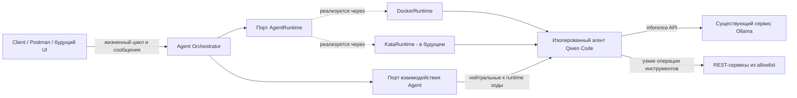
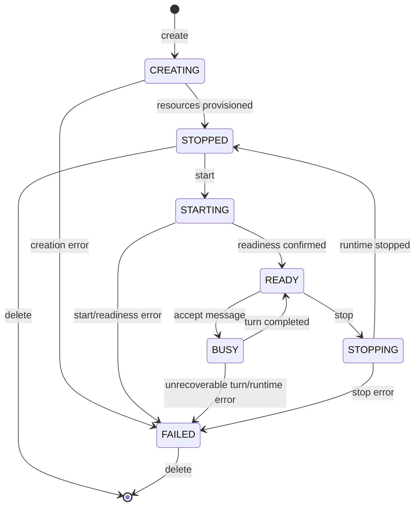

# Архитектура Universal Agent Runtime
Статус: целевая архитектура установлена в TASK-000. TASK-001 предоставляет Python-каркас; TASK-002 реализует нейтральный к runtime управляющий контракт; TASK-004 реализует `DockerRuntime`; TASK-006 реализует отдельный нейтральный conversation/session port и persistent Qwen adapter. API Orchestrator пока не существует.

## Назначение и область
Система создаёт и управляет изолированными экземплярами CLI-агентов через нейтральный к runtime Agent Orchestrator. Агент сохраняет состояние диалога, получает настроенные Skills и узко ограниченные Tools и использует внешний inference-сервис. Docker является локальным backend исполнения; Kata Containers — более поздний backend для корпоративной среды.
Декомпозиция задач — первая конфигурация агента, используемая для доказательства архитектуры. Она не должна становиться отдельным специализированным сервисом или зависимостью runtime core.
PoC должен доказать:
- создание, просмотр, обмен сообщениями, остановку и удаление агента через REST;
- изоляцию одного runtime, workspace и логической Qwen-сессии на каждого агента;
- многотуровый диалог на протяжении жизненного цикла агента;
- использование Qwen Code существующих настраиваемых endpoint и model Ollama;
- внедрение поведения через Skills и возможностей через ограниченные Tools;
- замену `DockerRuntime` на `KataRuntime` без переписывания бизнес-логики Orchestrator.
Streaming, поддержка Kata и вопросы production-платформы явно отложены до соответствующих задач backlog.

## Архитектурные факторы
- Qwen Code и поведение его сессии являются внешними интеграционными фактами, которые необходимо проверять, а не предполагать.
- Docker и Kata предоставляют разные инфраструктурные API, но должны обеспечивать эквивалентное поведение на уровне приложения.
- Промпты и инструменты Agent пересекают границы доверия и поэтому требуют изоляции и принципа наименьших привилегий.
- PoC требует диагностируемого поведения жизненного цикла без внедрения инфраструктуры production-масштаба.
- Каждая задача реализации может уточнять внутренние типы, но не может менять направление зависимостей, определённое здесь, без ADR.

## Системный контекст

Локальное развёртывание использует `DockerRuntime` и автономный mock Task REST-сервис, реализованный в TASK-003. Его синтетический контракт задокументирован в [mock-task-api.md](mock-task-api.md). Корпоративное развёртывание заменяет `KataRuntime`, существующий корпоративный сервис Ollama и одобренные корпоративные REST-сервисы. Mock-сервис находится вне графа зависимостей Orchestrator/runtime; use cases Orchestrator и правила домена остаются неизменными.

## Плоскости и направление зависимостей
Архитектура разделяет четыре области ответственности:

| Плоскость | Ответственность | Не должна владеть |
|---|---|---|
| Control plane | HTTP-граница, use cases Agent Orchestrator, политика жизненного цикла, метаданные агента | вызовы Docker/Kata SDK, промпты декомпозиции задач |
| Execution plane | runtime-драйвер, изолированный процесс агента, workspace, Qwen Code, runtime readiness | бизнес-решения Orchestrator, размещение модели Ollama |
| Inference plane | существующий Ollama API и настроенная модель Qwen | жизненный цикл Agent или авторизация Tools |
| Service plane | mock- или корпоративные REST-сервисы, доступные через узкие Tools | произвольный сетевой доступ Agent |

Mock-сервис TASK-003 является тестовой зависимостью service plane с process-local состоянием на каждый экземпляр приложения. Он предоставляет только поведение get/create/create-subtask/update. Он не зависит от Orchestrator, runtime, Qwen, Docker, корпоративного сервиса, базы данных или аутентификации. Ограниченный Tool adapter, который впоследствии может его вызывать, остаётся в области TASK-012.
Направление зависимостей на уровне исходного кода:

```text
HTTP adapter --> application use cases --> domain
                        |
                        v
                  application ports
                        ^
                        |
         Docker / Kata / Qwen / storage adapters
```
Composition code выбирает и связывает adapters. Модули domain и application не могут импортировать Docker/Kata SDK, модели HTTP framework или детали реализации Qwen.

## Основные понятия и владение
### Agent
Agent — aggregate жизненного цикла, которым владеет Orchestrator. Концептуально он владеет:
- `agent_id`, генерируемым control plane и стабильным на протяжении его жизненного цикла;
- одной непрозрачной ссылкой на runtime instance;
- одной логической identity Session, Qwen-специфичная ссылка которой принадлежит adapter;
- одной изолированной identity workspace;
- валидированной configuration;
- явными ссылками на capabilities Skill и Tool;
- нейтральным к runtime состоянием жизненного цикла.
Backend IDs, container objects, Kata objects и необработанные credentials не являются полями Agent. Запись Agent может содержать непрозрачные принадлежащие проекту references, отображение которых на backend скрыто внутри adapter.

### AgentRuntime
`AgentRuntime` — обращённый к application управляющий порт для изолированной execution unit. Его минимальная ответственность — create, start, status, stop и delete. Он не владеет семантикой диалога.
Реализованный асинхронный протокол, типизированные требования, observations, errors, правила идемпотентности и семантика ограниченных по времени вызовов определены в [контракте управления runtime](runtime-contract.md). `RuntimeHandle` — непрозрачная, привязанная к Agent project reference. `RuntimeObservation` содержит `ExecutionState` и независимый `Readiness`, но никогда не содержит принадлежащее Orchestrator состояние жизненного цикла Agent.
Контракт не предоставляет типы Docker/Kata SDK. Ходы Agent проходят через отдельный нейтральный к runtime `AgentInteraction` port, реализованный в TASK-006. Если доступ к Agent требует backend-specific механики, соответствующий adapter всё равно остаётся за этим отдельным портом; это не разрешает Orchestrator напрямую вызывать Docker/Kata. HTTP use cases и сериализация запросов относятся к TASK-010.
Drivers преобразуют декларативные требования, такие как workspace, environment, resource limits, network destinations и readiness, в backend operations. Общий conformance suite должен повторно использоваться сначала для `DockerRuntime`, а затем для `KataRuntime`.

### Workspace
Workspace — принадлежащая агенту граница файловой системы. Он содержит только данные, необходимые этому агенту, включая adapter-owned Qwen session artifacts, проверенные в TASK-006. Workspace не должен совместно использоваться разными агентами. Runtime-драйвер отображает нейтральную спецификацию workspace в Docker volume/bind mount или совместимое с Kata storage, не раскрывая это отображение application layer.
Stop сохраняет границу workspace/session Agent; успешный delete удаляет принадлежащее runtime storage и завершает жизненный цикл runtime identity Agent. TASK-002 определяет владение retry и partial-cleanup в управляющем контракте. TASK-006 определяет Session cleanup; его связывание с lifecycle Orchestrator остаётся в TASK-009/TASK-014.

### Session
Session — стабильная логическая identity диалога, связанная с одним Agent. Несколько сообщений для этого Agent повторно используют её; создание новой независимой Qwen-сессии для каждого сообщения запрещено. TASK-006 связывает generic `SessionReference` с opaque native Qwen UUID, обязательным native transcript и versioned project-owned JSONL history в одном per-Agent каталоге. Каждый новый Qwen process использует `--resume`, а валидированная project history повторно передаётся как authoritative context.
Публичный message log и внутренний context Qwen являются отдельными записями: adapter history обеспечивает восстановление context, тогда как API-visible timestamps/IDs и retrieval contract остаются в TASK-010.

### Configuration
Configuration Agent валидируется до provisioning и разделяется по областям ответственности:

| Configuration | Примеры | Владелец |
|---|---|---|
| Поведение Agent | выбранные Skills, instructions, model-facing limits | Agent/application |
| Capabilities | разрешённые операции Tools и schemas | Agent/application |
| Inference | reference на endpoint Ollama, имя модели, provider options | deployment configuration |
| Требования runtime | вид runtime, workspace, resources, разрешённые destinations | composition/runtime boundary |
| Secrets | credentials для inference или tools | environment или runtime secret mechanism |

Ни endpoint, ни port, ни model, ни credential, ни корпоративное значение не являются обязательными захардкоженными данными. Безопасные локальные mock defaults могут задаваться явно. Значения secrets никогда не хранятся в metadata Agent и не возвращаются через API.

### Skills
Skills — версионируемые пакеты поведения на стороне агента. Первый Skill, `task-decomposition`, предоставляет доменные инструкции и рекомендации по использованию tools. Runtime только доставляет выбранные Skills; он не содержит ветвлений для декомпозиции задач. Контракт упаковки и discovery окончательно определяется в TASK-013 после того, как станет известна интеграция Qwen.

### Tools
Tools — явные capabilities с типизированными операциями и принципом наименьших привилегий. Сценарий работы с задачами должен предоставлять операции вроде `get_task`, `create_task`, `create_subtask` и `update_task` после установления контракта mock API. Agents не могут выбирать произвольные URL или HTTP methods. Deployment configuration связывает каждый одобренный Tool с контролируемым service endpoint; код tool валидирует inputs и sanitizes outputs.

## Компоненты

| Компонент | Основная ответственность | Примечания по границе |
|---|---|---|
| Client | Отправляет HTTP-команды жизненного цикла/сообщений и читает результаты | Сначала Postman/HTTP; UI отложен |
| HTTP adapter | Валидирует transport data и отображает application errors в HTTP | Точные endpoints относятся к TASK-008..TASK-011 |
| Agent Orchestrator | Координирует use cases Agent, переходы состояний, выбор capabilities и отчётность об ошибках | Зависит только от принадлежащих проекту ports |
| Agent metadata store | Хранит configuration Agent, lifecycle и opaque references | Технология persistence отложена; наличие database не предполагается |
| AgentRuntime | Определяет нейтральный к runtime контракт lifecycle/control execution unit | Реализован в TASK-002 с общими conformance tests; семантика диалога остаётся в interaction port |
| Agent interaction port | Обменивается ходами с CLI-agent и связывает их с его логической Session | Реализован в TASK-006; отделён от runtime control и не определяет HTTP message schemas |
| DockerRuntime | Отображает порт на Docker для локальной разработки | Реализован в TASK-004; вызовов Docker вне этого adapter нет |
| KataRuntime | Будущее отображение того же контракта на Kata | Локально не реализуется до TASK-016 |
| Qwen adapter/launcher | Запускает Qwen Code и взаимодействует с ним через проверенные возможности CLI | Qwen Code не является моделью Ollama |
| Ollama | Размещает настроенную Qwen LLM вне agent runtime | Существующий сервис, доступный по сети |
| Skill loader | Передаёт выбранные behavior packages одному агенту | Не может предоставлять незаявленные tools |
| Tool adapter | Предоставляет Agent узкие одобренные операции | Не является произвольным REST proxy |
| Workspace/session storage | Изолирует per-agent manifest, project history, native Qwen transcript и workspace | Реализовано adapter-local в TASK-006; lifecycle wiring отложен |

## Модель жизненного цикла
Минимальные логические состояния: `CREATING`, `STARTING`, `READY`, `BUSY`, `STOPPING`, `STOPPED` и `FAILED`.


Эта модель намеренно компактна. `delete` удаляет aggregate после backend cleanup, а не вводит постоянное состояние `DELETED`. Runtime contract определяет идемпотентные вызовы, восстановление после прерываний и поведение partial-cleanup. Stop/delete уровня Agent во время `BUSY`, восстановление из `FAILED` и публичная concurrent-request policy остаются обязанностью TASK-009. Записи удаления driver являются recovery metadata, а не новым состоянием жизненного цикла Agent.
Orchestrator владеет политикой логических переходов состояний. Runtime-драйвер сообщает нейтральные к runtime observations и failures; он не пропускает backend state names в domain. Запущенный runtime сам по себе не означает `READY` Agent: readiness также требует ответа настроенного пути взаимодействия с агентом. Сообщение может начаться только когда Agent находится в `READY`, и в рамках PoC один Agent обрабатывает не более одного turn одновременно.

## Основные управляющие потоки и потоки данных
### Создание и запуск
1. HTTP adapter валидирует create request и передаёт принадлежащие проекту данные в Orchestrator.
2. Orchestrator создаёт identity Agent, разрешает одобренные Skills/Tools и записывает `CREATING`.
3. Настроенный driver AgentRuntime создаёт изолированные runtime и workspace и возвращает opaque handle.
4. Успешный provisioning переводит Agent в `STOPPED`; start переводит его через `STARTING`.
5. Runtime observation и agent-level readiness probe подтверждают как execution unit, так и interaction path. Только после этого Agent становится `READY`.
Будет ли `POST /agents` выполнять только create или create-and-start, намеренно отложено до TASK-009; внутренние lifecycle operations остаются раздельными.

### Stateful-ход сообщения
1. Orchestrator принимает сообщение только для Agent в `READY` и сериализует конкурентные turns для одного Agent.
2. Он переводит Agent в `BUSY` и маршрутизирует turn через отдельную нейтральную к runtime границу interaction Agent.
3. Повторно используются та же логическая Qwen-сессия и workspace Agent.
4. Qwen Code вызывает настроенный внешний inference endpoint Ollama.
5. Qwen Code может вызывать только выбранные операции Tool; tool adapter вызывает настроенный mock/corporate service.
6. Response и соответствующая metadata сообщения сохраняются, после чего Agent возвращается в `READY`; диагностированный невосстанавливаемый failure приводит к `FAILED`.
Механика Qwen resume и adapter persistence определена TASK-006. HTTP-visible message metadata, retrieval и concurrent-turn policy остаются результатом TASK-010.

### Остановка и удаление
1. Stop переводит подходящий Agent в `STOPPING` и просит AgentRuntime остановить instance.
2. Подтверждённый stop приводит к `STOPPED` и сохраняет session/workspace Agent; delete применяет cleanup policy, определённую задачами lifecycle/session.
3. Delete разрешён только в соответствии с lifecycle contract, просит тот же driver удалить backend resources, а затем удаляет/помечает запись Agent в соответствии с выбранным metadata store.
4. Ошибки cleanup остаются диагностируемыми и не должны сообщаться как успешное удаление.

## Направление публичного API
Первоначальное направление HTTP:

```text
POST   /agents
GET    /agents/{agent_id}
DELETE /agents/{agent_id}
POST   /agents/{agent_id}/messages
GET    /agents/{agent_id}/messages
```
`GET /agents/{agent_id}/events` и протокол SSE отложены до TASK-011. Endpoint payloads, семантика create/start, status codes, error schema, polling/readiness behavior и pagination принадлежат соответствующим API-задачам. Frontend не входит в scope.
TASK-009 должна выбрать и задокументировать нейтральные к runtime HTTP-операции для явного запуска и остановки существующего Agent. Их точная URI/action-форма намеренно не фиксируется в TASK-000. Stop должен оставаться отличным от delete, чтобы сохранение session/workspace при stop/start можно было проверить через публичный API.

## Отображение развёртывания
### Локальная фаза
```text
Client -> Agent Orchestrator -> AgentRuntime -> DockerRuntime
                                              -> isolated Qwen Code agent
Qwen Code agent -> configurable host/external Ollama
Qwen Code agent -> restricted tool -> mock Task REST API
```
Ollama не включается в agent image. Host routing является deployment configuration и не должен быть жёстко привязан к `localhost`, потому что `localhost` внутри container обозначает сам container.

### Корпоративная фаза
```text
Client/UI -> unchanged Orchestrator use cases -> AgentRuntime -> KataRuntime
                                                          -> isolated Qwen Code agent
Qwen Code agent -> configured corporate Ollama
Qwen Code agent -> restricted tool -> approved corporate REST service
```
Меняться должны только composition, runtime adapter и environment configuration. Если application use cases требуют Kata-specific ветвлений, граница runtime спроектирована неверно и должна быть пересмотрена.

## Критерии заменяемости Docker на Kata
Архитектура считается заменяемой только если сохраняются все следующие условия:
- imports Orchestrator/domain не содержат пакетов или типов Docker/Kata SDK;
- выбор runtime происходит в composition root из configuration;
- backend identifiers непрозрачны за пределами своего adapter;
- workspace, environment, resources, network, readiness и cleanup выражены как нейтральные требования;
- Docker- и Kata-specific state преобразуется в нейтральные к runtime observations, отличные от принадлежащего Orchestrator состояния жизненного цикла Agent, и в нормализованную error taxonomy;
- один и тот же набор conformance tests AgentRuntime может выполняться против обоих drivers;
- контракт payload/image Agent содержит Qwen Code, Skills и Tool adapters, но не встроенный сервер Ollama;
- поведение Agent и API schemas не ветвятся по виду runtime;
- каждый runtime обеспечивает эквивалентную per-agent isolation и capability restrictions, а все известные semantic gaps документируются в TASK-015/TASK-020.

## Границы безопасности
- По умолчанию запрещайте tool capabilities и network destinations; разрешайте только выбранные endpoints Ollama и сервисов.
- Никогда не монтируйте Docker socket или host-control API внутрь agent runtime.
- Монтируйте или копируйте Skills как несекретный, предпочтительно read-only контент; записываемые per-agent данные храните в собственном workspace.
- Получайте все credentials из environment/runtime secret injection и редактируйте их в errors и logs.
- Валидируйте `agent_id`, paths, message sizes, configuration и tool inputs на границах.
- Рассматривайте model output как недоверенные данные: tool calls требуют schema validation и allowlist операций.
- Не позволяйте одному Agent адресовать workspace, session или runtime handle другого Agent.
- Локально используйте mock data и endpoints; корпоративные endpoints/data никогда не попадают в repository.

## Ожидания по ошибкам и наблюдаемости
Ошибки должны сохранять operation, identifier Agent, стабильную category, retryability там, где она известна, и redacted cause. Ожидаемые категории включают invalid state, not found, configuration rejected, runtime unavailable, readiness timeout, agent protocol failure, inference unavailable, tool denied, tool service failure и cleanup failure. Точные типы определяются задачами реализации.
Для PoC достаточно структурированных application logs и доступных для просмотра записей lifecycle/message. Production observability stack и distributed tracing находятся вне scope.

## Отложенные решения и validation gates
Python 3.11+ packaging и неактивный composition root установлены в TASK-001.
TASK-002 устанавливает runtime control signatures и семантику lifecycle retry/recovery в [runtime-contract.md](runtime-contract.md).
TASK-005 проверяет фактическую конфигурацию Qwen Code `0.23.1` для внешнего Ollama, headless `stream-json` protocol и ограниченный `read_file` из официального container image; воспроизводимый probe и ограничения описаны в [qwen-ollama-integration.md](qwen-ollama-integration.md).
TASK-006 реализует `AgentInteraction` и combined native/project-owned Qwen Session persistence, описанную в [qwen-session.md](qwen-session.md). Следующее остаётся отложенным:
- HTTP schemas и отображение create/start (TASK-008..TASK-010);
- SSE или другой streaming-механизм после того, как будет известно фактическое поведение output Qwen (TASK-011);
- формат упаковки Skill и schema ограниченного Tool (TASK-012/TASK-013);
- capabilities Kata, отображение storage/network и isolation gaps (с TASK-015 и далее).
Каждый gate должен разрешаться на основании доказательств из repository и, где требуется, актуальной upstream-документации или исполняемого integration probe. Значимые отклонения от границ этого документа требуют ADR.

## Архитектурные решения
- [ADR-0001: Граница runtime-порта и driver](decisions/0001-runtime-port-and-driver-boundary.md)
- [ADR-0002: Граница per-agent isolation](decisions/0002-per-agent-isolation-boundary.md)
- [ADR-0003: Граница внешнего inference](decisions/0003-external-inference-boundary.md)
- [ADR-0004: Владение runtime retry и recovery](decisions/0004-runtime-retry-and-recovery-ownership.md)
- [ADR-0005: Qwen Session persistence ownership](decisions/0005-qwen-session-persistence.md)
