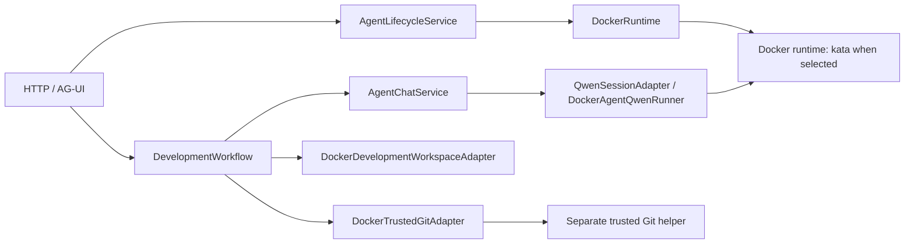
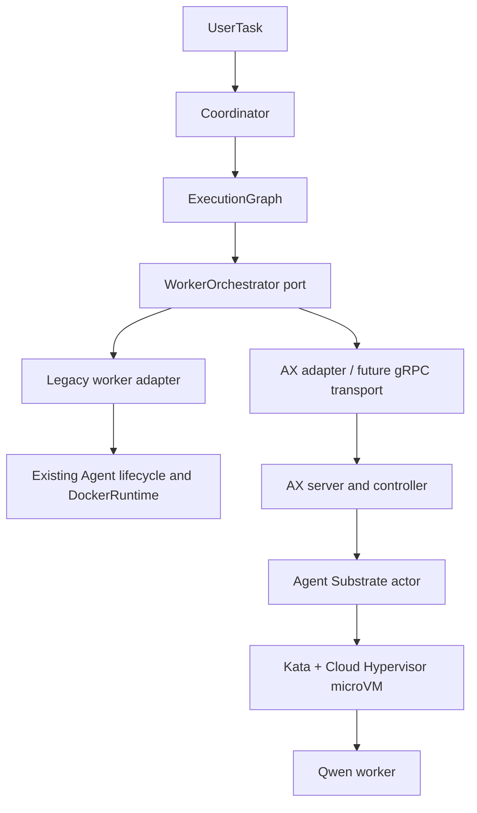

# AX and Agent Substrate migration

## Current architecture

The existing HTTP and AG-UI routes in `http_api.py` and `development_http.py`
call `AgentLifecycleService`, `AgentChatService`, and `DevelopmentWorkflow`.
`AgentLifecycleService` owns one agent record, runtime handle, session, and
workspace ID. `DevelopmentTaskService` owns a separate development task and
an exclusive claim on its agent; `DevelopmentWorkflow` advances its stages and
records bounded `DevelopmentTraceEvent` values. `composition.py` wires the
ports to Docker adapters. `UAR_RUNTIME_DRIVER=kata` causes `DockerRuntime`
to request Docker `runtime="kata"`; the existing Docker path is retained.

Skills come from `SkillPackageCatalog` and `FilesystemSkillRegistry`. The
Qwen runner materializes selected packages in the agent workspace. The
workspace adapter executes a closed operation set inside the owned agent.
The trusted Git helper alone mounts SSH key and known-hosts files. The agent
and Qwen process do not receive those private key mounts.

## Target architecture and responsibility mapping

| Current UAR responsibility | Target owner |
| --- | --- |
| Request interpretation, stage decisions | Coordinator and its future policy implementation |
| Agent and DevelopmentTask state | Retained for legacy mode; UserTask and ExecutionGraph sit above them |
| Worker provisioning and status | WorkerOrchestrator port; local adapter or AX control plane |
| Docker runtime and workspace volume | Legacy backend only |
| AX Task reconciliation | AX server/controller, backed by Agent Substrate |
| Actor placement and suspension | Agent Substrate |
| Untrusted execution isolation | Kata microVM, verified on the server |

## Current upstream contract and limits

The [current AX protobuf](https://github.com/google/ax/blob/main/pkg/apis/v1alpha1/ax.proto)
defines `ax.v1alpha1.AX` with `UpdateTask`, `GetTask`, `WatchTask`,
`SuspendTask`, `ResumeTask`, and `DeleteTask`. `TaskSpec` includes image,
command, literal environment values, CPU/memory requests and limits,
workspace references, and `debug`. `WorkspaceSpec` includes Git, MCP, and
skill registries; `ModelSpec` includes a secret key reference. The protobuf
reserves the former Task gateway field and has no Task sandbox class, process
limit, or secret reference. Its `TaskStatus` has a phase and conditions but
no command exit result. The [manifest guide](https://github.com/google/ax/blob/main/docs/manifests.md)
still shows Gateway, so the protobuf is used as the mapping authority. AX
[design](https://github.com/google/ax/blob/main/DESIGN.md) describes a Redis
event stream and controllers that reconcile Tasks into Substrate actors.

Agent Substrate's [API guide](https://github.com/agent-substrate/substrate/blob/main/docs/api-guide.md)
describes `WorkerPool.spec.sandboxClass: microvm` and a `microvm`
`SandboxConfig` supplying Kata plus Cloud Hypervisor assets. Its
[architecture](https://github.com/agent-substrate/substrate/blob/main/docs/architecture.md)
distinguishes ActorTemplate, Actor, WorkerPool, and worker pod. It warns that
parts are aspirational. The AX and Substrate APIs are alpha, and the present
AX Task schema does not bind a Task to a provable microVM pool. There is also
no proven way here to pass Qwen credentials through AX Task environment
without exposing literal values. Those gaps prevent a safe live launch.

The locally stable dependency is our own `WorkerOrchestrator` port and
domain graph. AX resource field names and phase handling are an experimental
mapping boundary. The adapter creates a Task manifest projection for tests;
its transport seam is not a gRPC client. The default composition leaves
that transport and placement verifier absent, so AX submit fails before any
Task is created.

## Execution lifecycle

1. A UserTask is created with a high-level specification.
2. The Coordinator returns an ExecutionGraph. The initial coordinator is
   deterministic: architect, developer, then tester and reviewer.
3. Runnable workers have all dependencies completed. A failed dependency
   blocks descendants; no blocked worker is submitted.
4. The Orchestrator submits a worker to the selected backend, observes and
   records status, and later aggregates results. Retry and review policy will
   belong above the infrastructure adapter.
5. In legacy mode, the optional bridge creates a separate Agent, starts it,
   sends the goal through the existing chat turn, and records the response.
   It refuses new worker execution unless the existing runtime driver is
   Kata. Legacy suspend and resume are unsupported.
6. In AX mode, submission requires a server-backed placement verifier and a
   transport. Neither is wired locally. AX status alone cannot reliably
   establish that a worker command completed, so result aggregation needs a
   separate trusted completion protocol in a later phase.

## Security, workspaces, skills, Git, and observability

- Every untrusted Qwen worker requires verified Kata/microVM placement. A
  normal Pod, runc container, or gVisor actor is not a substitute. A verifier
  must establish the class and its enforcement before allowing AX admission,
  then attest the actual actor on the server. Until that guarantee exists,
  AX launch stays disabled. No fallback to Docker/runc is permitted.
- Each worker gets a distinct logical workspace reference. In legacy mode,
  the existing lifecycle allocates a separate Docker volume and workspace ID.
  AX Workspaces need a server-side isolation and persistence design before
  reuse; a shared writable Workspace is unacceptable.
- Worker skills are explicit IDs. The local catalog checks availability and
  the existing runner supplies selected packages. AX Workspace skill registry
  semantics differ; publishing and pinning skill versions require later work.
- The trusted Git boundary remains outside Qwen. AX Workspace Git bootstrap
  must not receive an SSH private key through literal Task env or the worker
  filesystem. A server-side broker/helper with scoped operations is needed.
- Egress must be restricted to approved inference and tool endpoints. AX's
  former Gateway field is absent from the current Task protobuf; egress
  enforcement must be verified outside that field before launch.
- CPU and memory are represented in WorkerResources and mapped into AX Task
  requests/limits. The process limit is represented locally, but AX has no
  corresponding Task field; the server must enforce it separately. The
  existing DockerRuntime already enforces a 128 PID limit.
- Secrets stay out of task specs, prompts, workspaces, traces, and logs.
  `OrchestrationTraceEvent` carries only identifiers and event kinds above
  `DevelopmentTrace`; it does not replace the detailed development trace.
  Lifecycle control remains in the orchestrator, outside worker capabilities.

## Migration phases

1. **Local skeleton (this change):** domain, deterministic planner, backend
   port, legacy bridge, guarded AX mapper, trace vocabulary, config switch,
   and unit tests. Existing API paths remain on the legacy composition.
2. **Server integration:** establish AX gRPC transport and pin a tested AX
   revision; provision Substrate microVM WorkerPool and SandboxConfig; prove
   admission policy, egress, workspace and secret boundaries; add actor
   attestation and a trusted completion/result channel. Build an AX-compatible
   worker image with the required `ax-task-runner` contract; the current UAR
   Docker image is not asserted to satisfy that contract.
3. **Controlled rollout:** introduce UserTask API and durable orchestration
   repository, reconciliation, retries, cancellation and cleanup. Gate AX
   rollout on server checks and preserve the legacy route for rollback.

Local tests require no Kubernetes, AX, or Substrate installation. They cannot
prove a live Kata boundary or AX controller behavior. Server-side validation
must exercise actual placement and check the actor's runtime, not infer safety
from an AX `Running` status.

## PoC acceptance criteria

- A UserTask is planned into worker Tasks; AX reconciles each into a
  Substrate Actor on a `microvm` WorkerPool and a Kata-backed guest.
- The server records evidence tying each AX Task to its Actor, WorkerPool,
  SandboxConfig, and actual Kata/Cloud Hypervisor process.
- Each worker has an isolated workspace, bounded CPU/RAM/process use,
  restricted egress, and no SSH private key or raw remote Git credential.
- A trusted result channel distinguishes command completion and failure;
  trace events and cleanup are observable end to end.
- A missing or failed microVM verification rejects the task without creating
  an alternative runc or gVisor worker. Existing UAR Docker/Kata flow remains
  operational as the fallback.
